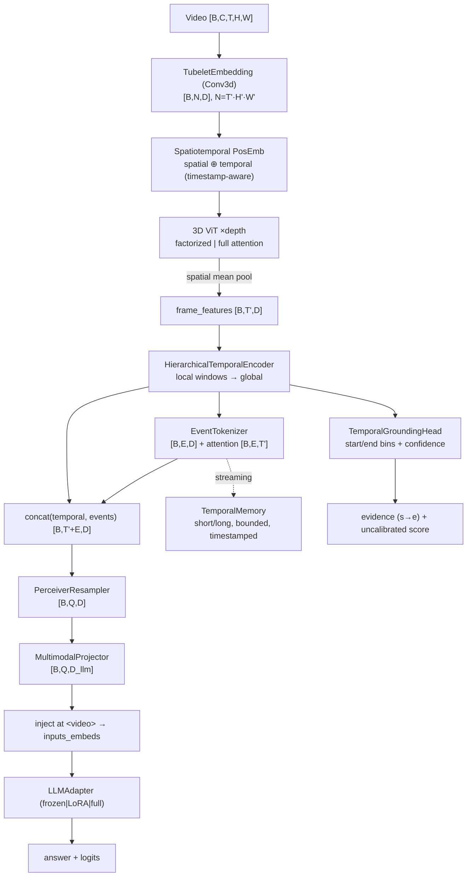

# Viora‑1 Architecture

Viora turns a video into contextualized spatiotemporal tokens, compresses them
into semantic events and bounded memory, resamples to a fixed set of visual
tokens, injects those into a language model, and predicts an answer **plus the
temporal evidence** that grounds it.

## Data flow

## Tensor contracts

| Symbol | Meaning | Shape |
|--------|---------|-------|
| Video | decoded clip | `[B, C, T, H, W]` |
| `T'` | temporal token positions | `T / tubelet_size` |
| `H',W'` | spatial patch grid | `H/patch, W/patch` |
| `N` | vision tokens | `T'·H'·W'` |
| tokens | any stage | `[B, *, D]` |
| masks | padding | `[B, *]`, `True` = valid |

Masks use `True = valid` everywhere and are converted to attention semantics only
at the `MultiHeadAttention` boundary. Every frame/token keeps its **timestamp**.

## Components

### Tubelet embedding — `models/embeddings/tubelet_embedding.py`
A strided `Conv3d` (kernel = stride = `(tubelet, patch, patch)`) patchifies the
video into non‑overlapping spatiotemporal cubes. Returns `[B, N, D]` and a
`TokenGrid(t, h, w)`; divisibility is validated and token counts are unit‑tested.

### Positional embedding — `positional_embedding.py`
Separable **spatial** (`[h·w, D]`, broadcast over time) and **temporal**
(`[T', D]`, broadcast over space) embeddings, each `learnable | sincos | none`,
with grid interpolation when the input grid differs. A **timestamp** path replaces
the temporal table with sin‑cos of real per‑frame seconds → variable frame spacing
is representable.

### Attention — `models/attention/`
One `MultiHeadAttention` (self+cross, SDPA with a numerically‑equivalent manual
fallback, `key_padding_mask` + full `attn_mask`, optional weight return) underlies:
**SpatialAttention** (attend within a frame — reshape `[B,N,D]→[(B·t),s,D]`),
**TemporalAttention** (attend across time — `→[(B·s),t,D]`, temporal‑mask aware),
and **FactorizedAttention** (spatial then temporal, ViViT‑style — `O(t·s²)+O(s·t²)`
vs `O(N²)`).

### 3D ViT — `models/vision/vit3d.py`, `blocks.py`
Pre‑norm blocks (LayerNorm/RMSNorm, MLP/SwiGLU, stochastic depth,
gradient‑checkpoint hooks) in `full` or `factorized` mode. Emits the token
sequence and spatially‑pooled `frame_features [B,T',D]`.

### Hierarchical temporal encoder — `models/temporal/hierarchical_encoder.py`
`depth − global_layers` **local** blocks with a banded attention window (radius
`local_window`) model short motion; the remaining **global** blocks relate distant
clips. A differentiator: it decouples local motion from long‑range structure.

### Event tokenizer — `event_tokenizer.py`
`num_queries` learnable queries cross‑attend to the temporal sequence → event
tokens `[B,E,D]`; the last cross‑attention map `[B,E,T']` is returned for
interpretability (which moments each event attends to — not claimed as exact
boundaries).

### Temporal memory — `temporal_memory.py`
Bounded, timestamp‑aware, tiered: recent events verbatim (**short‑term**), older
events compressed (**long‑term**) via mean‑merge or FIFO/importance eviction. A
learnable importance head scores events (uncalibrated). Enables long‑video and
streaming without sending every token to the LLM.

### Resampler / Q‑Former — `models/multimodal/`
`PerceiverResampler`: fixed `Q` learnable queries cross‑attend to the visual
tokens → `[B,Q,D]` regardless of input length. `QFormer` additionally conditions
the queries on the question (BLIP‑2 style). `MultimodalProjector` maps vision→LLM
dims (`linear|mlp`).

### Visual‑token injection — `token_injection.py`
Expands a single `<video>` placeholder into the `Q` projected embeddings at the
embedding level, rebuilding `attention_mask` and `labels` so visual positions are
ignored (`-100`) in the LM loss. Never stringifies embeddings.

### Language model — `models/language/llm_adapter.py`
`LLMAdapter` wraps an HF `AutoModelForCausalLM` (`frozen|lora|full`; LoRA needs
`peft`, else a clear error) or a built‑in `DummyLanguageModel` (tiny trainable
causal decoder) so everything runs with **no download**.

### Heads & losses — `models/heads/`, `losses/`
Grounding (discretised start/end bins → seconds + confidence), retrieval (shared
normalized space), classification, confidence (uncalibrated). Losses: contrastive,
matching (+ hard negatives), captioning (LM), grounding, temporal order, masked
video; combined by `MultiTaskLossManager`, which logs each component and surfaces
(never hides) NaN/Inf.

## Complexity (T frames, s spatial, N=T'·s tokens, Q queries, L language tokens)

| Stage | Cost |
|-------|------|
| Tubelet | `O(N·D)` |
| Full ViT attn | `O(N²·D)` |
| **Factorized ViT attn** | `O(t·s²·D + s·t²·D)` ≪ full for video (`s≫t`) |
| Temporal (local+global) | `O(T'·w·D + g·T'²·D)` |
| Resampler | `O(Q·N·D)` |
| LLM | dominated by `L` (decoupled from video length by `Q`) |

The resampler + memory are the load‑bearing scaling decisions: LLM cost depends on
`Q` and `L`, not on video length. See [DESIGN_REVIEW.md](DESIGN_REVIEW.md).
